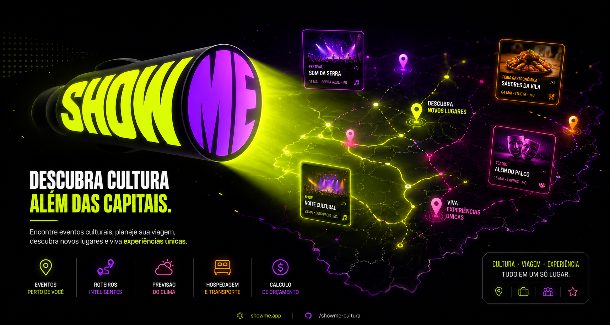

# Show-Me
Projeto Focado no TCC de Técnico de Informática para Internet

## Figma (Protótipo) do projeto: 
https://www.figma.com/design/OfIRwYhogB1vUhzETBJfBr/Prot%C3%B3tipo-ShowMe?node-id=0-1&t=ab5oVOBfROuqjMkk-1
<div align="center">



# SHOW ME

### 🌎 Discover culture beyond the capitals.


<br>


</div>

---

# 🎭 Sobre o Projeto

O **SHOW ME** é uma plataforma inteligente voltada à descoberta de eventos culturais regionais, conectando usuários a experiências além dos grandes centros urbanos.

A proposta integra:

* 📍 geolocalização;
* 🎪 eventos culturais;
* 🛣️ planejamento de trajetos;
* 🌦️ previsão climática;
* 🏨 hospedagem;
* 💰 estimativa de orçamento;

Tudo em uma única experiência moderna e intuitiva.

---

# ✨ Funcionalidades

```txt
📍 Descoberta de eventos próximos
🛣️ Rotas inteligentes
🌦️ Previsão do clima
🏨 Hospedagem integrada
💰 Planejamento de custos
⭐ Recomendações personalizadas
🎭 Eventos regionais e culturais
```

---

# 🖥️ Preview

<div align="center">


</div>

---

# 🚀 Tecnologias

<div align="center">


</div>

---

# 🎨 Design System

| Cor             | Hex       |
| --------------- | --------- |
| Neon Green      | #D9FF00 |
| Electric Purple | #7B00FF |
| Hot Pink        | #FF3CAC |
| Deep Black      | #050505 |

---

# 🧠 Conceito

> “Mostrar experiências culturais escondidas além das capitais.”

O SHOW ME busca incentivar:

* turismo regional;
* acesso à cultura;
* valorização de cidades menores;
* descoberta de novos eventos.

---

# 📌 Roadmap

* [x] Identidade visual
* [x] Protótipo inicial
* [x] Sistema de eventos
* [ ] Integração com APIs
* [ ] IA de recomendação
* [ ] Aplicativo mobile
* [ ] Sistema de usuários

---

# 📊 Estatísticas

<div align="center">


</div>

---

# 🌐 Visão

O projeto pretende transformar a forma como pessoas descobrem cultura, criando uma experiência digital moderna voltada à exploração cultural regional.

---

<div align="center">

### ✨ SHOW ME

Discover. Travel. Experience.

</div>
